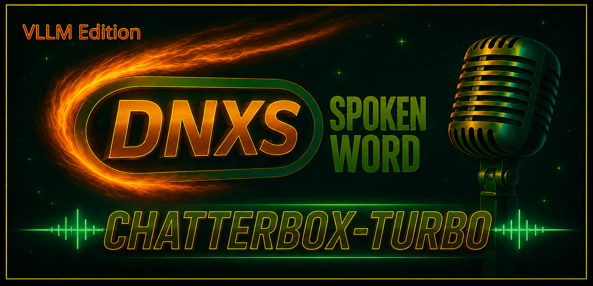
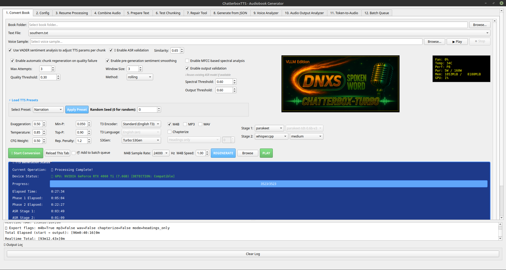
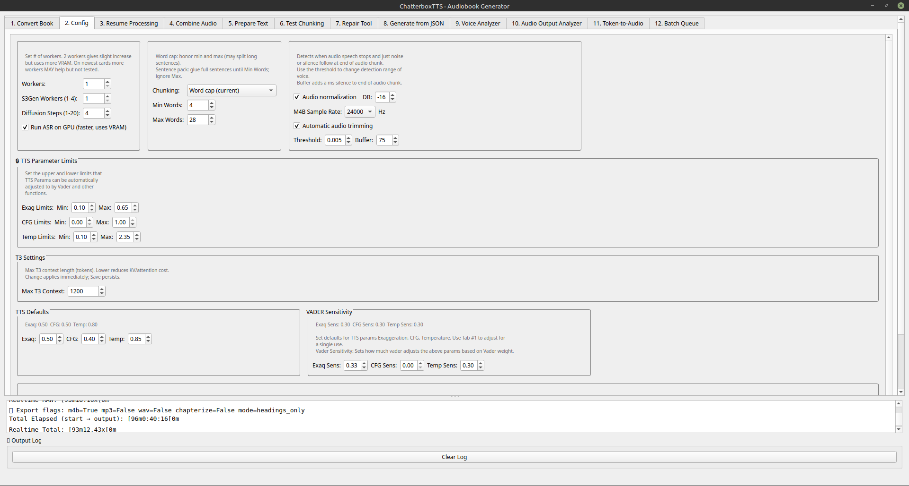
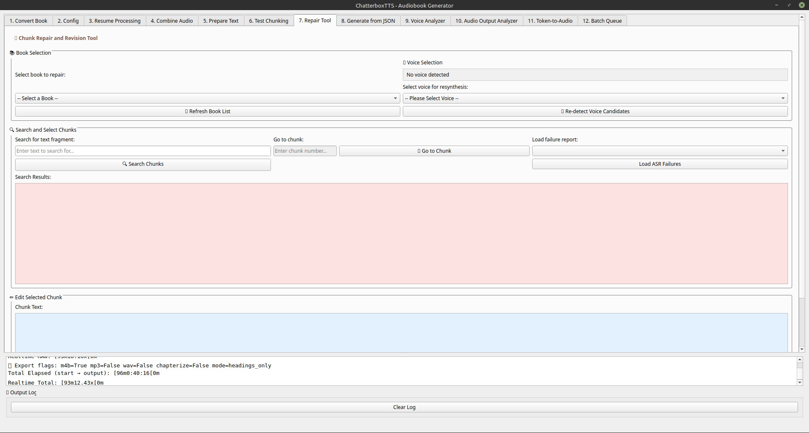

# DNXS Spoken Word · Pocket-TTS GPU Edition



DNXS Spoken Word · Chatterbox Turbo VLLM Edition is a local audiobook and text-to-speech workstation built around Chatterbox TTS, vLLM, Turbo S3Gen, ASR validation, repair workflows, JSON-driven generation, audio analysis, and batch processing.

It is designed for books, long-form documents, and controlled production workflows where the user wants a repeatable pipeline with visible progress, saved settings, and repairable outputs.

## Core Workflow

1. Select source text and voice sample on **Tab 1**.
2. Tune quality, ASR, and export settings on **Tab 1** and **Tab 2**.
3. Convert directly or add jobs to the batch queue.
4. Review failures in **Repair Tool** or resume interrupted work.
5. Combine, analyze, or generate from JSON when needed.

## Screenshots

### Main Window



### Config Tab



### Repair Tab



### Batch Progress


## What This Program Does

- Converts text into audiobook audio using Chatterbox-based synthesis.
- Supports multiple TTS modes, including Standard T3 and Multilingual V2/V3.
- Supports S3Gen selection: Turbo or Standard.
- Supports punctuation and inline pause handling.
- Supports ASR validation and automatic regeneration.
- Writes WAV, M4B, and MP3 outputs as configured.
- Provides repair, resume, combine, analyze, JSON generation, and token-to-audio tools.
- Supports persistent batch queueing with append-only batch reports.

## Installation Notes

This project is intended to run from the existing local environment and model cache used by the application.

- Start from the provided launcher or configured virtual environment.
- Keep model files, voice samples, and source books in the expected folders.
- If the app reports missing dependencies, install them in the project environment before running again.

## Tab Reference

### Tab 1: Convert Book

Main conversion surface.

Use this tab to pick the source text file, choose the voice sample, select TTS and ASR behavior, and start conversion.

#### Main Inputs

- Source text file picker
- Voice sample path
- Voice preview controls
- Preset selector
- TTS encoder selector (select Standasr, Multilingual v2, Multilingual V3)
- T3 language selector
- S3Gen selector (Turbo or Standard)
- Chapter mode selector (Uses Chapter/Part from text and or specified minutes)


#### Main Checkboxes

- VADER sentiment analysis (varies TTS parameters Per chunk based on analyzed emotional content of text)
- ASR validation (checks output and regenerates chunks that are bad)
- Automatic regeneration (set to 3 times. can be changed)
- Sentiment smoothing (used with VADER)
- MFCC validation
- Output validation
- Write M4B
- Write MP3
- Write WAV
- Chapterize
- Add to batch queue 

#### Buttons

- Start Conversion

- Apply Preset (set preset TTS settings and seed value)

#### Presets

- Narration
- Expressive Mod
- Expressive
- Exposition

#### TTS Encoder Options

- Standard (English T3) (Most stable with fewest ASR fails = faster end to end conversion times)
- Multilingual V2
- Multilingual V3 (bit more natural but less stable - 2x more ASR failures than Standard meaning more regenerations and longer processing time)

#### 

#### S3Gen Options

- Turbo S3Gen
- Standard S3Gen

#### Chapter Mode Options

- Headings only (Finds headings like Chaper, Part and uses those)
- Headings, otherwise minutes (if no headings then uses selected mintues for chapter)
- Headings + maximum duration

#### ASR Settings

ASR runs in 2 stages.  Stage 1 is best to set to BASE model.  It's FAST but finds more errors.  Stage 2 ONLY checks chunks listed in Stage 1 and generally MEDIUM is the best model for this.  This is MUCH faster than running medium in a single stage by several orders of magnitude.  A 8 hour audio can take 30+ min for a single stage check at medium.  2 stage as described will be roughly 5 min total. 

#### ASR Stage 1 Backend Options

- faster-whisper
- whisper.cpp
- parakeet ( fastest ASR option about 2x faster-whisper)

#### ASR Stage 1 Model Options

- tiny
- base (best option)
- small
- medium
- large-v3
- large-v3-turbo
- distil-small.en
- distil-medium.en
- distil-large-v3

#### ASR Stage 2 Backend Options

- faster-whisper
- whisper.cpp (the fastest option but requires installer to build it as it's not a straight download)

#### ASR Stage 2 Model Options

- Disabled
- tiny
- base
- small
- medium (best overall)
- large-v3 (larger models take much longer for little or no better result than medium)
- large-v3-turbo
- distil-small.en
- distil-medium.en
- distil-large-v3

#### Main Spinners

- Similarity: `0.50` to `1.00`
- Max Attempts: `0` to `10`
- Quality Threshold: `0.10` to `1.00`
- Window Size: `1` to `10`
- Exaggeration: app-configured range
- Temperature: app-configured range
- CFG Weight: app-configured range
- Min-P: `0.000` to `0.500`
- Top-P: `0.50` to `1.00`
- Repetition Penalty: `1.0` to `3.0`

- Random Seed: `0` to `999999999`

### Tab 2: Config

Global runtime and synthesis behavior.

Use this tab to control chunking, normalization, pauses, silence values, and default parameter bounds.

#### Core Controls

- Worker count (legacy/future use leave set to default)
- S3Gen worker count (legacy/future use leave set to default)
- Diffusion steps (higher steps better sounding audio - start with defaullt. Higher=longer generation times)
- ASR GPU checkbox (use GPU for ASR)
- Chunking mode selector (min/max words per chunk. Too high max word will crash program.  Sentence mode makes a chunk per sentence.  Default is best)
- Minimum words per chunk (single word sentence can cause issues - this combines sentence until minimum is met)
- Maximum words per chunk
- Audio normalization checkbox 
- Target LUFS
- M4B sample rate selector (all voices are resampled at 24KHz - setting this hight just makes bigger files with no quality gain)
- Automatic audio trimming checkbox (trims dead silence from audio)
- Threshold
- Buffer in milliseconds


#### Normalization Options

- Loudness
- Peak
- Simple
- None

#### Hidden Compatibility Controls

- Target peak dB
- Mid-chunk energy drop detection
- TTS hum artifact detection

#### TTS Parameter Bounds

Sets boundries for VADER

- Exaggeration min/max
- CFG min/max
- Temperature min/max
- T3 context size (don't change this - weird things happen possibly. I can't remember.)

#### Default Parameter Spinners

What loads when program starts

- Default exaggeration
- Default CFG
- Default temperature
- VADER sensitivity settings

#### Silence Controls

Default silence based on text chunk idetification.  

- Chapter start silence
- Chapter end silence
- Section break silence
- Paragraph end silence

Inline Pauses set custom pause [silence] times for punctuation.  

- Comma silence
- Period silence
- Question mark silence
- Exclamation silence
- Chunk-end silence

Setting any time to 0 dissable that items and uses the default model pause/silence.  Lets user set custom pauses for only what they want.

#### Pause Rules

This allows you to set pauses directly into text. If you want a 1.5 second pause in between chapters just put ~1500 into the text (1500ms=1.5s)

- `~500` in source text becomes `[pause:500ms]`
- `~1000` becomes `[pause:1000ms]`


### Tab 3: Resume Processing

**Legacy - might work might not**

Used to continue interrupted work.

Controls:

- Refresh List
- Resume Selected Book

### Tab 4: Combine Audio

Will combine all audio chunks into  a wav file.  Used when Repairs are made in the repair tab (ie when ASR still has fails after it's regeneration attempts needing user intervention).  Future edits will allow the choiice of format and chapterization.

Used to merge chunk audio into final output.

Controls:

- Select main book folder
- Combine Audio Chunks

Note: do not pick the `audio_chunks/` subfolder directly. Select the book root.

### Tab 5: Prepare Text

Legacy - developer option used in testing. Possibly still useful to check chunking.

Used to prebuild chunk data from an input text file.

Controls:

- Select source text file

This uses the current main tab settings to prepare the text for later conversion.

### Tab 6: Test Chunking

Used to inspect chunk behavior before a production run.

Controls:

- Max Words per Chunk: `1` to `200`
- Min Words per Chunk: `1` to `50`
- Artifact Threshold: `0.01` to `0.20`
- Artifact Margin: `0.05` to `0.50`
- Enable artifact cleaning

### Tab 7: Repair Tool

Used to inspect failed chunks, regenerate audio, and compare revisions.

#### Selectors

- Book selector
- Voice selector
- Fail report selector ( Select all stage 2 fails or just the asr failed [ie chunks that still fail after ASR attempted repairs] for manual edit and regeration to get that perfect audio.
- Boundary selector (sets boundry type for boundry silence/pause)

#### Boundary Options

- none
- paragraph_end
- chapter_start
- chapter_end
- section_break
- period
- comma
- semicolon
- colon
- question_mark
- exclamation
- dash
- ellipsis
- quote_end

#### Repair Spinners

- Exaggeration: `0.0` to `3.0`
- CFG: `0.0` to `2.0`
- Temperature: `0.0` to `2.0`

#### Repair Buttons

- Refresh Book List
- Re-detect Voice Candidates
- Search Chunks
- Go to Chunk
- Load ASR Failures
- Play Original (Plays audio saved in audio_chunks folder)
- Save Changes (can't remeber what this does - probably save TTS params to chunk json file)
- Resynthesize (click this after you have altered text to make a new audio file)
- Play Revised (play resythesized file)
- Accept Revision (clicl this when you are happy and it overwites chunk in audio_chunks folder. User will have to combine chunks in combine audio tab)

The chunk number field is 1-based.

### Tab 8: Generate from JSON

Used to generate audiobook audio from a prepared JSON description. (can be existing or make from the Prepare Text tab)

Controls:

- Voice selector
- Browse
- Refresh Voice List
- Generate Audiobook from JSON
- Play
- Pause
- Stop
- Skip back 10 seconds
- Skip forward 10 seconds

### Tab 9: Voice Analyzer

**LEGACY DOES NOT WORK**

Used to inspect voice samples and optionally apply cleanup guidance.

Controls:

- Detailed Praat Analysis checkbox
- Add Files
- Remove
- Clear All
- Analyze Selected
- Analyze All
- Save Plot
- Save Report

#### ### Tab 10: Audio Output Analyzer

**LEGACY DOES NOT WORK**

Used to inspect completed audiobook audio.

Controls:

- Detailed Technical Analysis checkbox
- Chapter-by-Chapter Analysis checkbox
- Commercial Production Standards checkbox
- Add Audiobook Files
- Remove
- Clear All
- Analyze Selected
- Analyze All Files
- Save Analysis Report
- Save Quality Plots

### Tab 11: Token-to-Audio

Used for direct token/audio conversion experiments.

Controls:

- Diffusion steps: `1` to `10`
- Skip post-processing checkbox
- Enable FP16 checkbox
- Start Conversion
- Cancel

### Tab 12: Batch Queue

Used for queued, ordered, persistent runs.

#### Queue Controls

- Run Batch Queue
- Move Up
- Move Down
- Edit
- Remove
- Clear All

#### Queue Behavior

- Jobs are added from Tab 1 when **Add to batch queue** is checked.
- Tab 12 has no Add button by design. Use TAb #1 to add to queue
- Jobs are stored in `Audiobook/batch_queue.json`.
- Batch reports append to `Audiobook/batch_run_report.txt`.
- Queue execution runs one item at a time.
- Each item keeps book path, voice path, and runtime settings.
- Edit removes the selected item, loads its settings into Tab 1, and switches focus to the main tab.
- After editing, the user can add the job back through Tab 1 and start again.

## Batch Report Contents

Batch reports should record:

- Run time
- Input book path
- Input filename
- Voice path
- Voice filename
- Phase timings
- ASR timings
- Elapsed time
- Audio duration
- Realtime factor
- Stage 1 failures
- Stage 2 failures
- Remaining failures
- Min-P
- Top-P
- Repetition penalty

## Chatterbox Acknowledgement

This project uses and acknowledges Chatterbox TTS from Resemble AI.

```bibtex
@misc{chatterboxtts2025,
  author       = {{Resemble AI}},
  title        = {{Chatterbox-TTS}},
  year         = {2025},
  howpublished = {\url{https://github.com/resemble-ai/chatterbox}},
  note         = {GitHub repository}
}
```

## Responsible Use Notice

This software is intended for lawful and responsible text-to-speech applications, including accessibility, personal use, research, education, and the creation of audio from content that you own or are authorized to use.

Users are responsible for ensuring that all text, books, documents, voices, recordings, and other materials processed with this software are used in accordance with applicable laws and the rights of their respective owners.

This software is not intended to facilitate copyright infringement, piracy, unauthorized distribution of copyrighted works, fraud, impersonation, deception, harassment, or other unlawful or abusive activity.

Do not use this software to reproduce or distribute copyrighted material unless you own the necessary rights or have permission or another lawful basis to do so. Likewise, do not use synthesized or replicated voices in a manner that falsely represents another person, misleads others about the origin of audio, or violates applicable rights or laws.

The developers do not endorse or encourage misuse of this software. You are solely responsible for the content you process, the audio you generate, and how that audio is used or distributed.

Use this software responsibly and respect copyright, licensing terms, privacy, and the rights of others.

## License and Credits

DNXS Spoken Word · Pocket-TTS GPU Edition is licensed under the GNU General Public License v3.0. See `LICENSE`.

Copyright © 2026 danneauxs.

This project is built upon and uses third-party open-source software and machine-learning models. Those components remain subject to their respective licenses.
